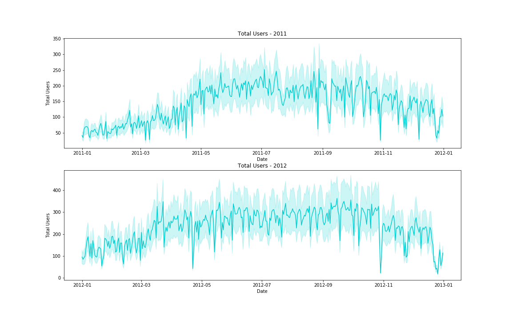
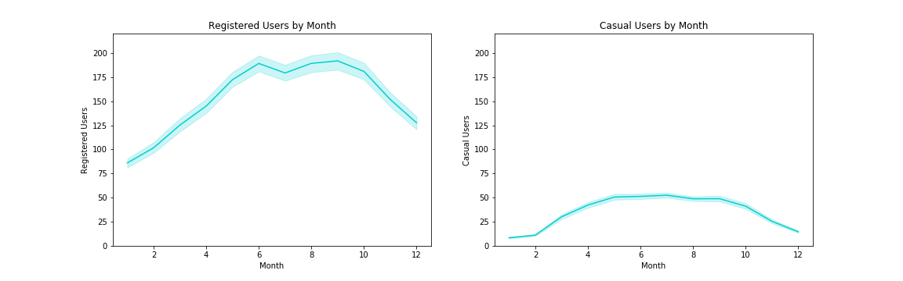
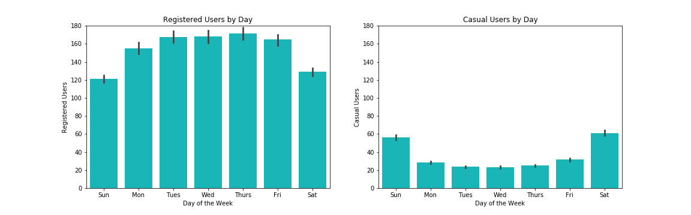
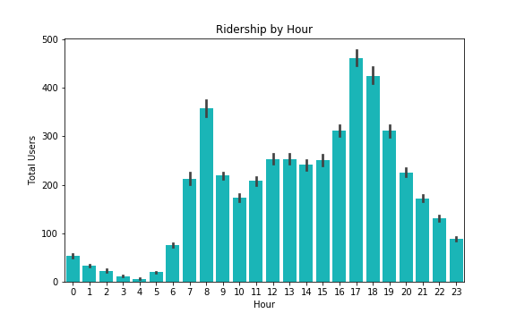
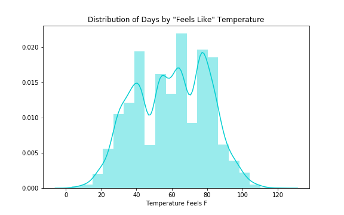
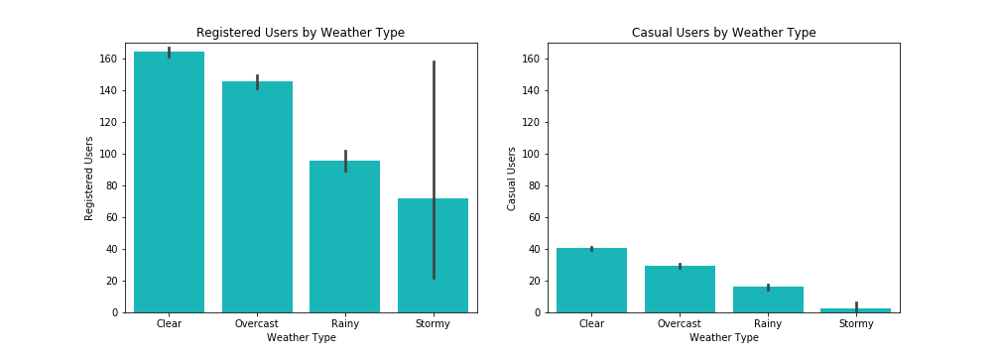
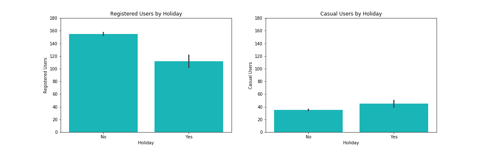
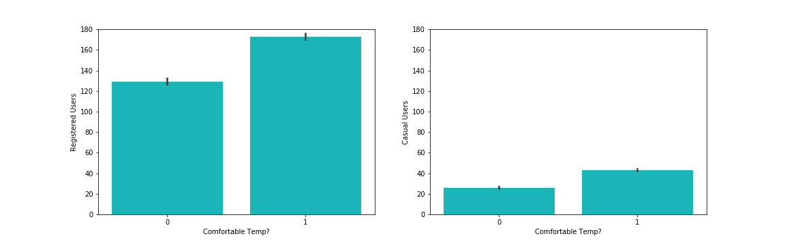
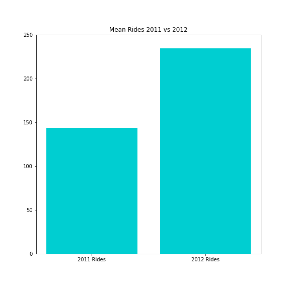

# Understanding Capital Bikeshare Ridership

## Using Exploratory Data Analysis to Understand Customer Segmentation

Created by Aren Carpenter

Fall 2020

## Introduction

After some more advanced neural network projects focusing mainly on computer vision, I wanted to return to the data scientist's bread and butter, generating business insights from data through EDA and rigorous hypothesis testing. Utilizing the [Capital Bikeshare rider data](https://data.world/data-society/capital-bikeshare-2011-2012) from 2011-2012, I will illuminate the differences between registered and casual bikers and how various environmental and temporal features affect these populations.

With a climate crisis looming and alternative methods of personal transportation gaining popularity, short-term bike rentals through companies like CitiBike and Capital Bike offer users easy access to bikes. The main cohort of registered renters are business professionals on their morning and evening commutes, while a casual cohort utilizes the bikes for leisure mostly on weekends.

## Repo Navigation

- **[01_Exploratory_Data_Analysis](01_Exploratory_Data_Analysis.ipynb)**: Contains EDA and data visualizations
- **[02_Hypothesis_Testing](02_Hypothesis_Testing.ipynb)**: Contains hypothesis testing to illuminate 
- **[Images](Images/)**: Directory for images/visualizations

## Exploratory Data Analysis

The data was collected and some small cleaning was required, mainly for time series analysis. Some types were recast, but, unlike most real-world data, this set was mostly intact. I wanted to focus on creating interesting and useful visualizations, but in the future will feature an incredibly messy data cleaning project.

### Data Visualizations

Let's start by looking at some aggregated ridership patterns. 

#### Total users throughout the year

We see rider data from both 2011 and 2012. As we expect, there are more riders in the late spring through early fall when the temperatures and weather are the most comfortable. Ridership begins to fall off in November through April. Overall ridership is higher in 2012 than in 2011 (p-value = 7.21e-247), perhaps signaling greater adoption and market share of Capital bike in Washington, D.C.

 

#### Total users by month

Just reinforcing the previous time series evaluation resampled by month, showing higher ridership in the spring and summer. However, grouping by rider population begins to show the differences between registered and casual cohorts that we will continue to explore below. Registered users account for a majority of the rides regardless of month.

#### Total users by day of the week

Here's our starkest difference between our two cohorts. Registered users ride mostly duing the work week for their commutes, while casual users ride mostly on the weekends. If you don't separate the two populations than ridership is almost perfectly equal across all days, thus showcasing how understanding customer segmentation in your data is very important.

#### Rides by hour of the day

Looking at ridership by hour in the day also illustrates the main cohort of registered users renting for their commutes as we see peaks around 8 am and 5-6 pm. 

#### "Feels like" temperature distribution

We'll use temperature for some feature engineering later, but looking at the "feels like" temperature we see a wide range of temperatures at which users have rented bikes, from about 0 degrees to 120 degrees. This accounts for humidity, windage, etc. and is more extreme than raw temperatures, but provides a better sense of what the rider is actually experiencing. 

#### Ridership by weather type

Regardless of the weather, registered users ride more than casual users. Within groups, there are more rides in good weather that declines as weather worsens. Interestingly, registered users still rent at relatively high rates during the worse weather (classified as "Heavy Rain + Ice Pallets + Thunderstorm + Mist, Snow + Fog"). Utilizing an ANOVA test on the different groups, we can reject our null hypothesis and conclude that there is a statistically significant difference among the groups (F-stat = 94.79, p-value = 7.48e-61).

#### Ridership on holidays

There are more rides by registered users not during holidays, likely just because more days are not holidays and the average American worker only gets about 10 holiday days off. Casual users, by contrast, are more likely to ride on holidays than normal days. 

## Hypothesis Testing

#### Do users ride more during comfortable temperatures?

First, what does it mean to be comfortable? Surveying some friends who are avid bikers, I chose 50 to 85 degrees Fahrenheit to be comfortable. Second, I split registered and casual riders, because registered riders may have less of an option if biking is their main commuter option. 

Both registered and casual ride more days if the temperature is comfortable (Registered: p-value = 7.69e-81, Casual: p-value = 2.49e-118). There were, on average, only 25 casual riders an hour during uncomfortable temperatures. 

#### Does Weather Type affect ridership of registered users?

The F-stat (94) and p-value (7.4e-61) are both significant, thus we can reject our null hypothesis that ridership is equal among all weather types (RegisteredUsersGood = RegisteredUsersOkay = RegisteredUsersPoor = RegisteredUsersBad). We can conclude that there is a statistically significant difference between the groups, but without further ad-hoc tests we cannot conclude which group(s) is different.

#### Are there more riders in 2011 or 2012?

After summing the total rides for each year, I used a t-test to compare the means of 2011 and 2012 mean hourly rides, and there was a statistical difference between the two means (F-stat = -34, p-value = 7.21e-247). This suggests that Capital bikeshares user base is growing or there is more conversion of casual to registered users who ride more frequently. 

#### Percentage of rides that are rush hour commutes?

Let's investigate what percentage of rides are likely to be commuters. After splitting on workweek vs weekend, I tried defining two different versions of rush hour, a two hour period morning and evening and a three hour period. The two hour period was defined as 7-8am and 5-6pm, and the three hour period was defined as 7-9am and 5-7pm. 

Using our two hour definition, the commuter hour average rides per hour was over 400, 70% higher than non-commuter hours. Adding an hour to each morning and evening commuter window actually decreased this percentage to 67%, suggesting that there are fewer commuters in hour 9am and 7 pm.

#### Do more riders ride in the morning or evening?

There is a statistically significant difference between the number of morning rides and evening rides (p-value = 1.04e-61). If registered riders are full-time bike commuters, why are morning and evening rides not more similar? Is there a pain point here about bike availability in residential areas compared to the business center, aka bikes are becoming clustered downtown as people bike in? We would really need some GIS data to identify where bikes are located at specific hours. 

## Conclusion